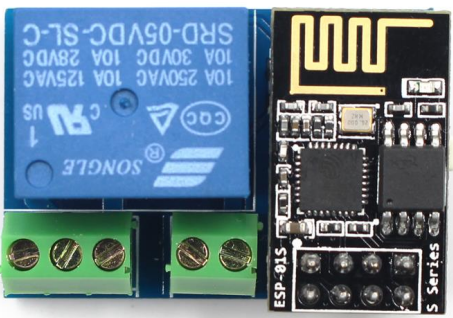
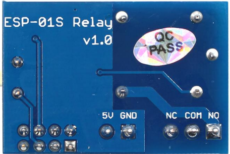
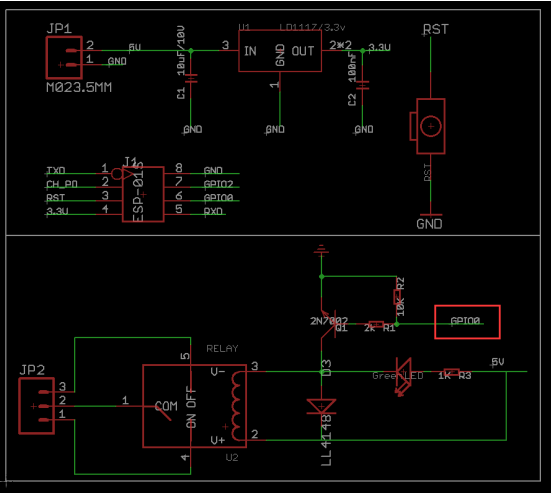

# ESP-01S Relay v1.0

This ESP-01S Relay based on AI-Thinker ESP-01S WIFI module. It is designed for smart home, Internet of thing and others DIY project. With this smart relay, you will easy to DIY your smart switch to control any device by your phone anywhere.
In the version, we use the GPIO0 of ESP-01S to control the Relay by Hight level.

## Schematic

## Parameter
 
 * Working voltage: DC5V
 * Working current: ≥250mA
 * Communication: ESP-01S WIFI module
 * Transmission distance: the maximum transmission distance of 400m (open environment, mobile phone equipped with WIFI module)
 * Load: 10A/250VAC 10A/30VDC, the relay pulls 100,000 times
 * GPIO0 of ESP-01S Control the Relay (High level active)
 * Product size: 37 * 25mm
 
## Usage
  1) Hardware connection
     
     Just plug the ESP-01S to the 2*4 pin header after download the code to ESP-01S.
     
     Show as below:
     
  2) Power supply
     
     Connect a DC 5V power to the GND and VCC.
     
     
  ** Work in progress... **
     
